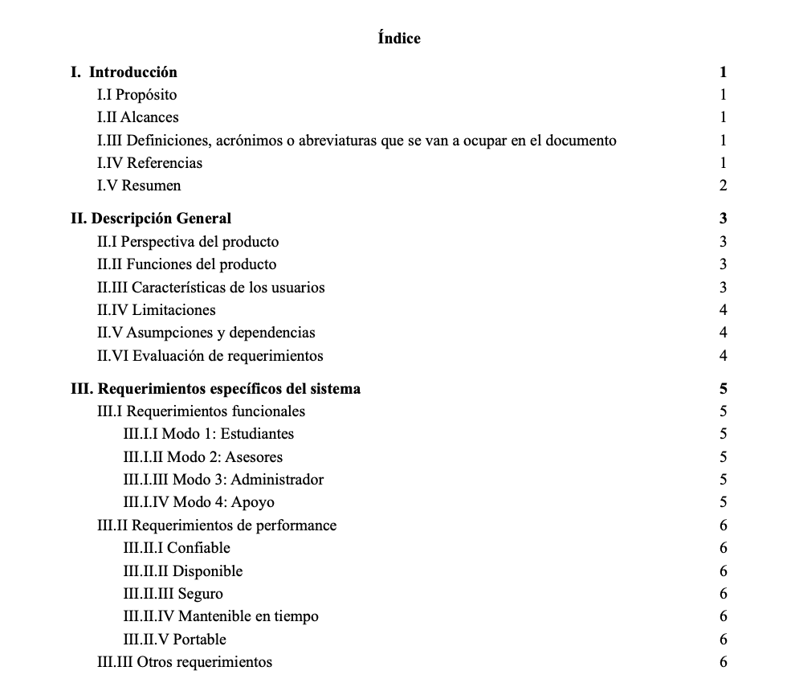
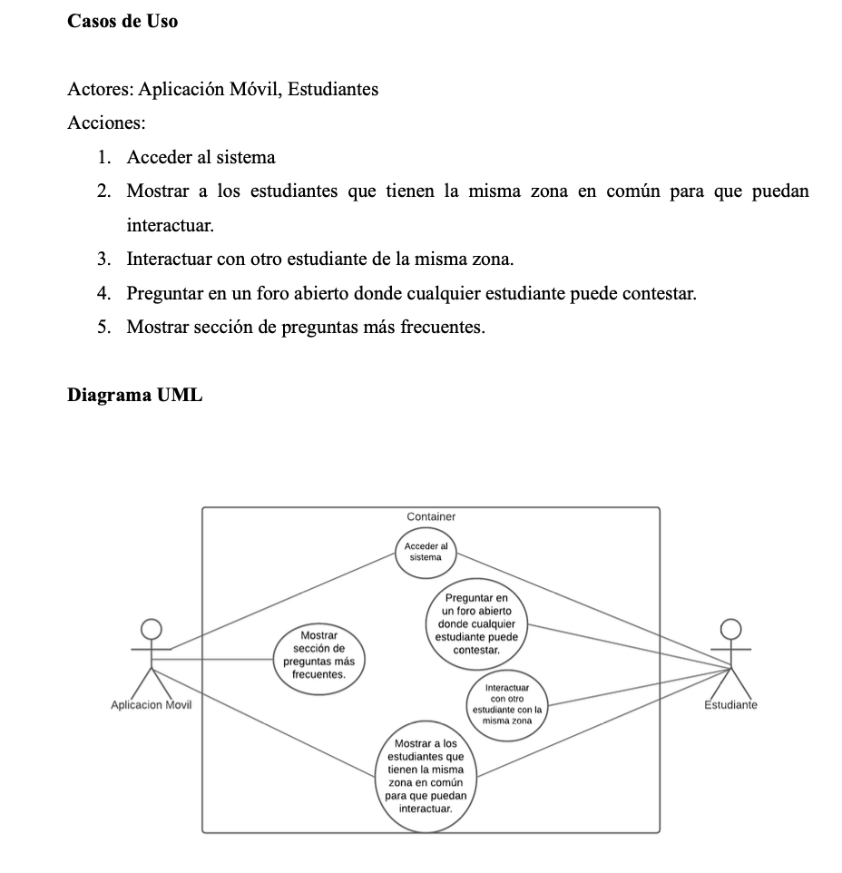
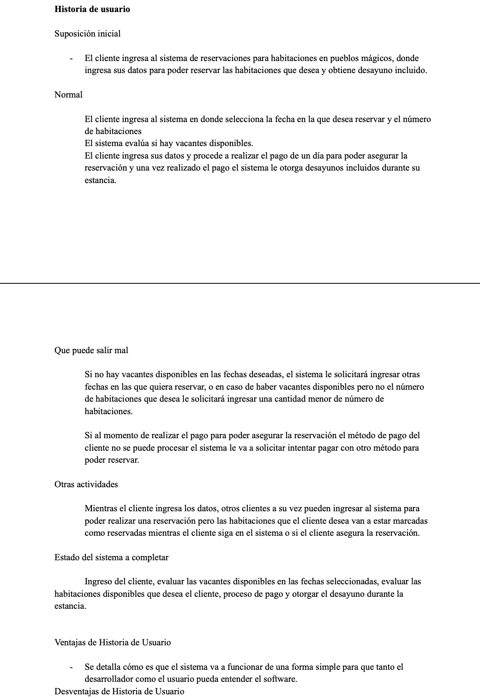

#   Introduction to Software Requirements Documentation

## Description
This activity was part of the subject "Software Requirements" where I was asked to produce most of the documentation required for a software development. 

## Main Learnings 
* Use Cases
* User Stories
* Agile Methodologies Concepts
* Functional/Non Functional Requirements
* UML Diagram
* Documentation in General

## Screenshots

 